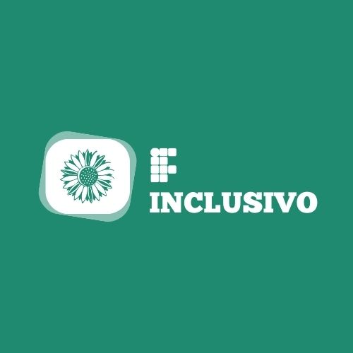

# IFInclusivoFrontEnd

Este projeto foi gerado através do [Angular CLI](https://github.com/angular/angular-cli) version 16.2.16.

## Para rodar o projeto

Após clonar rode usando `ng serve` ou `npm run start`. Após a aplicação estar rodando, acesse o  endereço `http://localhost:4200/`. 

## Detalhes do Projeto

O projeto consta com páginas de acesso externo abertas à consulta de qualquer usuário da rede e participações e comunicações, além de sugestões, consultas e outros serviços internos como chat disponíveis para usuários cadastrados mediante login e senha. 

## Nossa Equipe

- Ariana Mesquita
- Ariane de Sá
- Clarice Alves
- Davi Félix
- Heloísa Ribeiro
- Jhennyf Lima
- Isaías Valdemir
- Pedro Flávio
- Pedro Henrique Ferreira
- Walmir Cardoso

## Professores Orientadores:
- Júnio Lima,
- Paulo Mansur,
- Gabriel 
